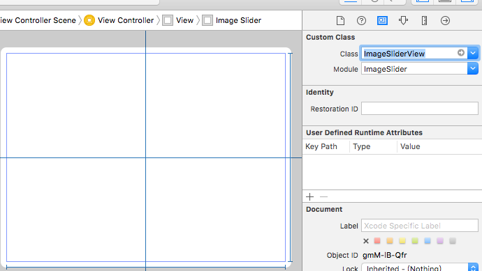

# ImageSlider


[](https://github.com/Carthage/Carthage)

Image slider (image scrolling) framework.


## Installation
### Carthage

Using [Carthage](https://github.com/Carthage/Carthage):

```
github "LinShiwei/ImageSlider"
```

### Manually
* Just include the two ｀.swift｀ files found on the `ImageSlider` folder on the demo Xcode project.

## Usage 

Just add a `UIView` object to your `storyboard` and change its `Class` and `Module`:



Connect an `IBOutlet` to the `UIView` object:

```swift
@IBOutlet weak var imageSlider: ImageSliderView!
```

And set its `images` property:

```swift
let image1 = UIImage(named: "image1")!
let image2 = UIImage(named: "image2")!
let image3 = UIImage(named: "image3")!
let image4 = UIImage(named: "image4")!
let images = [image1,image2,image3,image4]

imageSlider.images = images
```
**Don't forget to `import ImageSlider` at the top of the file using ImageSlider.**

## License

Source code of this project is available under the standard MIT license. 

Please have a look at [the license file](LICENSE.md).


